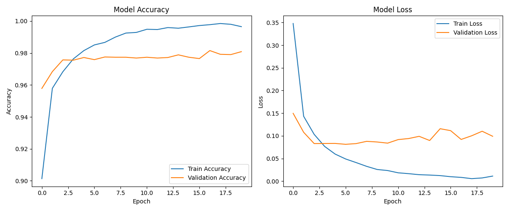
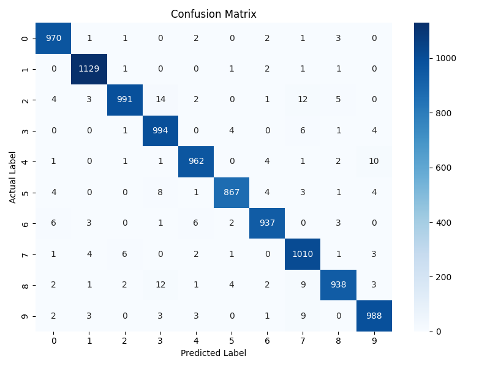
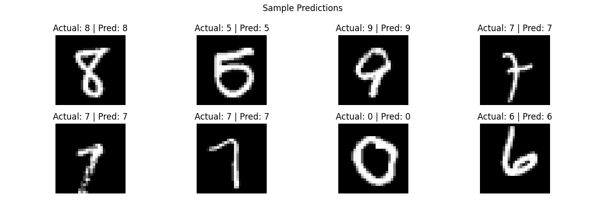
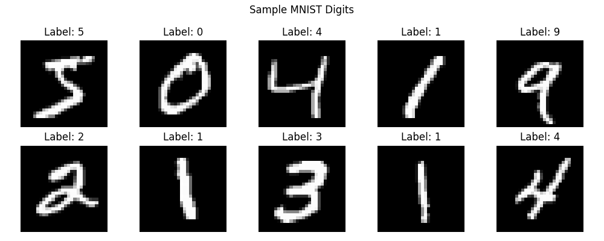

# ✍️ Handwritten Digit Recognition using Deep Neural Networks

[](https://www.python.org/)
[](https://www.tensorflow.org/)
[](https://streamlit.io/)
[](LICENSE.txt)

A deep learning web application that recognizes handwritten digits (0–9) in real time, built with an Artificial Neural Network (ANN) trained on the MNIST dataset and deployed as an interactive Streamlit app.

---

## 🔗 Live Demo

**👉 [https://mnist-digit-recognition-salek.streamlit.app/](https://mnist-digit-recognition-salek.streamlit.app/)**

---

## 📖 Project Overview

This project implements an end-to-end machine learning pipeline for handwritten digit recognition:

1. **Model Development** — an ANN trained on the MNIST dataset (60,000 training images, 10,000 test images)
2. **Prediction Pipeline** — a reusable module (`predict.py`) that preprocesses any digit image and returns a prediction
3. **Web Application** — an interactive Streamlit app (`app.py`) where users draw a digit on a canvas and get an instant prediction with confidence score

---

## ✨ Features

- 🎨 Interactive drawing canvas — draw any digit with your mouse
- 🔮 Real-time digit prediction with confidence percentage
- 📊 Probability distribution bar chart across all 10 digit classes
- 🧹 One-click clear/reset
- 📱 Clean, responsive Streamlit UI with sidebar instructions

---

## 📊 Dataset

**MNIST Handwritten Digits Dataset**

| Attribute | Value |
|:----------|:------|
| Training images | 60,000 |
| Test images | 10,000 |
| Image size | 28 × 28 pixels, grayscale |
| Classes | 10 (digits 0–9) |
| Source | `tensorflow.keras.datasets.mnist` |

---

## 🧠 Model Architecture

```
Input Layer (784 neurons — flattened 28×28 image)
        │
        ▼
Dense (128 neurons) → ReLU
        │
        ▼
Dense (64 neurons) → ReLU
        │
        ▼
Dense (10 neurons) → Softmax
        │
        ▼
Output: Digit probability distribution (0–9)
```

**Compilation:**
- Optimizer: Adam
- Loss: Categorical Crossentropy
- Metrics: Accuracy

---

## 📈 Training Results

| Metric | Value |
|:-------|:------|
| Test Accuracy | ~97–98% |
| Test Loss | ~0.08 |
| Training Epochs | 20 |
| Batch Size | 128 |

### Learning Curves


### Confusion Matrix


### Sample Predictions


---

## 🖥️ Screenshots



---

## ⚙️ Installation

Clone the repository and install dependencies:

```bash
git clone https://github.com/muhammadsalek/mnist-digit-recognition.git
cd mnist-digit-recognition
pip install -r requirements.txt
```

---

## ▶️ Usage

### Run the Streamlit app locally

```bash
streamlit run app.py
```

### Predict a single image from the command line

```bash
python predict.py path/to/image.png
```

---

## 📁 Project Structure

```
mnist-digit-recognition/
│
├── app.py                    ← Streamlit web application
├── predict.py                 ← Prediction pipeline module (PIL-based preprocessing)
├── train_model.py             ← Model training script
│
├── model/
│   └── mnist_model.keras      ← Trained ANN model
│
├── images/
│   ├── sample_digits.png
│   ├── learning_curves.png
│   ├── confusion_matrix.png
│   └── sample_predictions.png
│
├── requirements.txt
├── README.md
├── LICENSE.txt
└── .gitignore
```

---

## 🛠️ Tech Stack

- **Python** — core programming language
- **TensorFlow / Keras** — model building and training
- **NumPy** — numerical computation
- **Pillow (PIL)** — image loading, grayscale conversion, and resizing (no OpenCV dependency — avoids system-library install issues on cloud platforms)
- **Matplotlib** — visualization
- **scikit-learn** — evaluation metrics
- **Streamlit** — web application framework
- **streamlit-drawable-canvas-fix** — actively maintained interactive drawing canvas component

---

## 🚀 Deployment

Deployed on **Streamlit Community Cloud**:

```
GitHub Repository
      │
      ▼
Streamlit Community Cloud
      │
      ▼
Connect Repository → Select app.py → Deploy
      │
      ▼
Live URL: https://mnist-digit-recognition-salek.streamlit.app/
```

> **Note:** Streamlit Community Cloud sets the Python version once, at initial deployment, via "Advanced settings" — it cannot be changed afterward without deleting and redeploying the app. A `runtime.txt` file has no effect on the platform's Python version selection.

---

## 🎯 Skills Demonstrated

- Python Programming
- Deep Learning (ANN)
- TensorFlow & Keras
- Image Classification
- Model Evaluation & Confusion Matrix
- Data Visualization
- Streamlit Web Development
- Git & GitHub
- Model Deployment
- Reproducible Machine Learning Pipeline
- Debugging cloud deployment environments (dependency resolution, Python version management)

---

## 👤 Author

**Md Salek Miah**
Department of Statistics, Shahjalal University of Science and Technology (SUST)

[](https://github.com/muhammadsalek)
[](https://www.linkedin.com/in/md-salek-miah-b34309329/)

---

## 📄 License

This project is licensed under the MIT License — see the [LICENSE.txt](LICENSE.txt) file for details.

*⭐ Star this repo if it helped you learn deep learning and deployment!*
